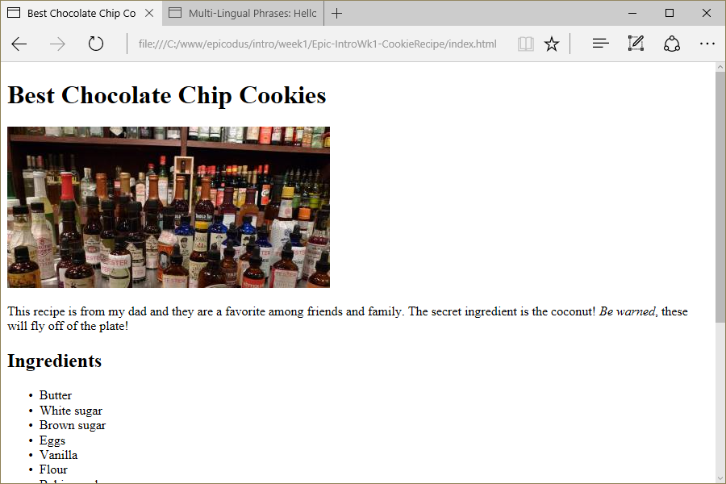

# Cookie Recipe
Version 0.0.1: August 1, 2016
by [Karen Freeman-Smith](https://karenfreemansmith.github.io) and [Stephen Newkirk](https://github.com/NewkirkS)

### Technologies Used
HTML, Git, Github

## Description
*Epicodus Intro to Programming Week 1 Pair Project with Stephen Newkirk: Refactor an existing website to properly format HTML and practice working with other people's code.*

## Setup/Installation
* [View on Github Pages](https://karenfreemansmith.github.io/Epic-IntroWk1-CookieRecipe)

 __OR__
* Clone project to your computer
* Open index.html in your favorite browser

## Support & Contact
For questions, concerns, or suggestions please email karenfreemansmith@gmail.com

## Known Issues
* None

## Legal
* Licensed under the GNU General Public License v3.0

Copyright (c) 2016 Copyright _[Karen Freeman-Smith](https://karenfreemansmith.github.io) & [Stephen Newkirk](https://github.com/NewkirkS)_ All Rights Reserved.
